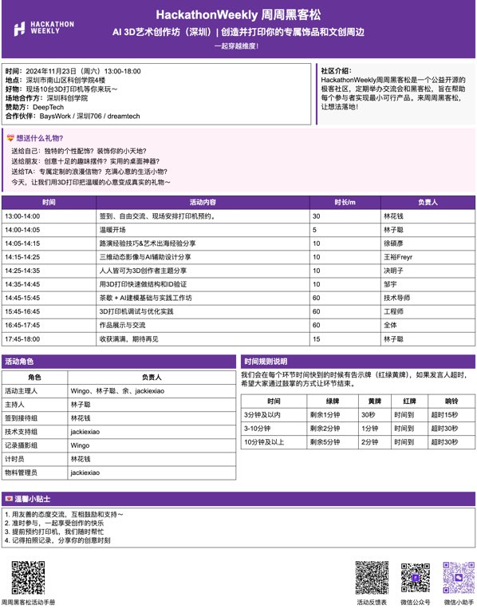

# 周周黑客松 Agenda / 活动安排表
本仓库用于生成周周黑客松活动的安排表，可以帮助大家更好的管理和记录每一次活动的内容和进度。

## 使用方法
1. 用 windsurf / Cursor 打开这个文件夹
2. 将本次活动特定的二维码照片放到 public 文件夹下
3. 给 AI 提供下面的 Prompt （可以根据自己的需求进一步修改）

```

请帮我修改这个活动安排表 agenda.html 

1. 注意不要修改样式，保持这个表格的风格
2. 保证能够一页纸打印，如果内容过多可以适当修改间距
3. 在页面最下方添加 public 文件夹下的照片
    a. ai-3d-doc.png : 活动教程
4. 根据下面的内容对应修改 Agenda.html

本次活动的主题
XXX
本次活动的内容
XXX

本次活动分工
- 活动主理人：XX
- 主持人：XX
- 签到接待组：XX
- 技术支持组：XX
- 记录摄影组：XX
- 计时员：XX
- 物料管理员：XX
```

4. Chrome 打开 Agenda.html （如果修改了代码，记得刷新页面才生效）
5. Cmd + P 打印为 PDF (或者直接交给打印机打印)

##  效果预览

